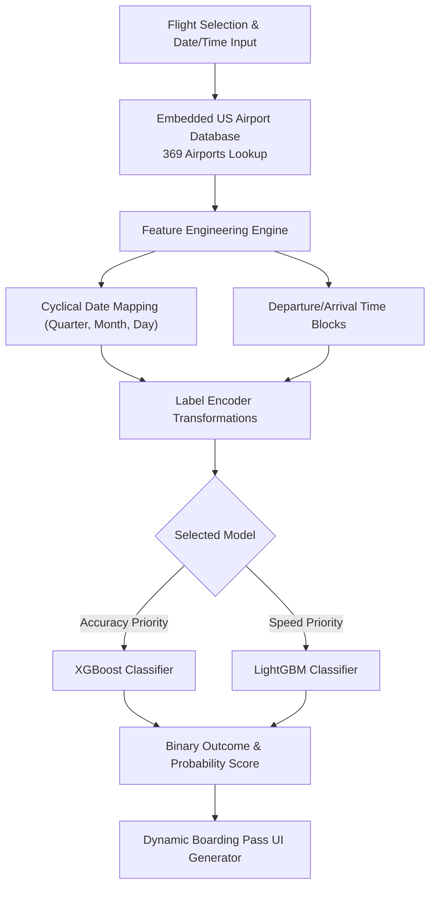

# 🎫 SkyWise AI — Flight Delay Predictor (Boarding Pass Edition)

Forecast flight arrival delays (≥15 mins) from airline operational data and temporal patterns.

SkyWise AI is a premium Streamlit web application designed to forecast whether a flight will experience an arrival delay. Styled with a dark-mode glassmorphic interface inspired by airline boarding passes, SkyWise AI combines machine learning predictions (XGBoost & LightGBM) with an embedded 369 US airport database and interactive ticket micro-animations.

[](https://skywise-ai.streamlit.app/)

   

---

## ⚡ Key Highlights & Business Value

- **Dual Ensemble Model Architecture**: Offers real-time side-by-side inference using **XGBoost** (optimized for deep accuracy) and **LightGBM** (leaf-wise tree split for ultra-fast throughput).
- **Authentic Boarding Pass Interface**: Dynamically renders flight paths, scheduled departure/arrival times, risk status, and animated delay stamps onto a digital boarding pass.
- **Built-in US Aviation Database**: Embedded lookup database containing geographical and operational details for **369 US airports** and major operating carriers.
- **One-Click Test Itineraries**: Includes pre-loaded high-volume flight routes (e.g., *ATL → FLL*, *JFK → LAX*, *ORD → DEN*) for instant evaluation.

---

## 🛠️ Tech Stack & Dependencies

| Layer | Technology | Function |
|---|---|---|
| **UI Framework** | [Streamlit](https://streamlit.io/) | Interactive web application framework & component state engine |
| **Machine Learning** | [XGBoost](https://xgboost.ai/), [LightGBM](https://lightgbm.readthedocs.io/) | Pre-trained Gradient Boosted Decision Tree classifiers |
| **Categorical Preprocessing** | [scikit-learn](https://scikit-learn.org/) | Pre-fitted high-cardinality categorical LabelEncoders |
| **Data Processing** | [pandas](https://pandas.pydata.org/), [NumPy](https://numpy.org/) | Time-block extraction, cyclical temporal features, & dataset management |

---

## 🏗️ System Architecture & Inference Pipeline



---

## 📊 How the ML Pipeline Works

1. **Temporal Feature Transformation**: Derives cyclical calendar signals (Quarter, Month, Day of Month, Day of Week) and maps departure/arrival hours into standardized FAA operational time blocks (e.g., `1600-1659`).
2. **High-Cardinality Encoding**: Converts airport IATA codes, carrier IDs, and regional codes using pre-fitted encoders stored in `Utils/label_encoders.pkl`.
3. **Dual-Model Inference**: Evaluates the processed feature vector through the chosen classifier, outputting:
   - **Binary Status**: On-Time vs. Delayed ($\ge 15$ mins)
   - **Confidence Score**: Dynamic probability distribution rendered as live progress bars.

---

## 📁 Repository Structure

```tree
Flight Delay Prediction/
├── Data/
│   ├── cleaned_flight_delay_data.csv  # Cleaned evaluation dataset
│   └── sample.xlsx                    # Sample flight itineraries
├── Models/
│   ├── flight_delay_xgboost_model.pkl # Pre-trained XGBoost classifier
│   └── flight_delay_lgbm_model.pkl    # Pre-trained LightGBM classifier
├── Utils/
│   └── label_encoders.pkl             # Categorical feature encoders
├── app.py                             # Main Streamlit UI & styling logic
├── requirements.txt                   # Dependency manifest
└── README.md                          # Documentation
```

---

## 🚀 Quick Start & Local Setup

### 1. Clone Repository & Navigate
```bash
git clone https://github.com/tarun05-design/SkyWise-AI.git
cd SkyWise-AI
```

### 2. Create Virtual Environment
```bash
# Windows
python -m venv venv
venv\Scripts\activate

# macOS / Linux
python3 -m venv venv
source venv/bin/activate
```

### 3. Install Dependencies
```bash
pip install -r requirements.txt
```

### 4. Run Application
```bash
streamlit run app.py
```
Open [http://localhost:8501](http://localhost:8501) in your browser.

---

## 👤 Author & Connect

**Tarun P** — Machine Learning & Full Stack Developer
- 🌐 Portfolio: [tarun-portfolio.vercel.app](https://tarun-portfolio.vercel.app)
- 🐙 GitHub: [@tarun05-design](https://github.com/tarun05-design)
- 📧 Email: [tarunparthasarathy65@gmail.com](mailto:tarunparthasarathy65@gmail.com)
